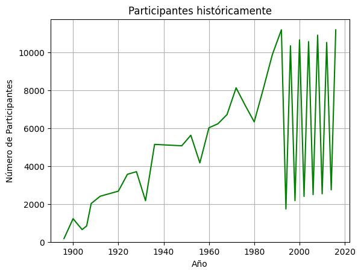
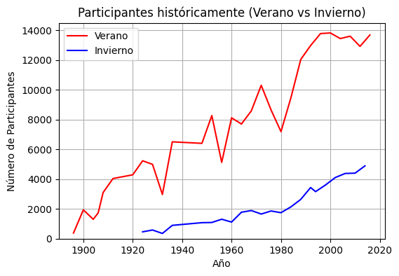
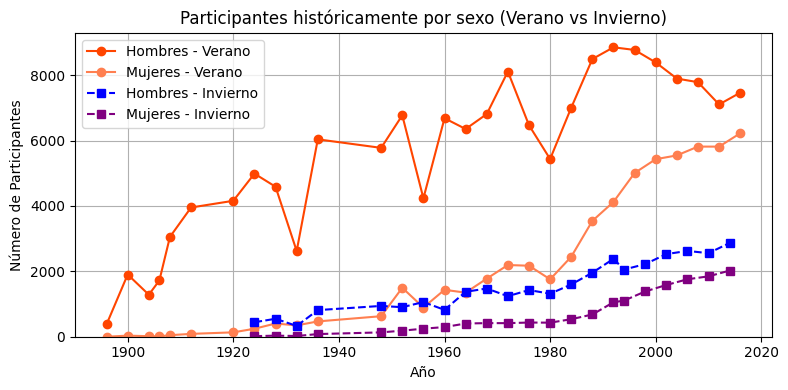
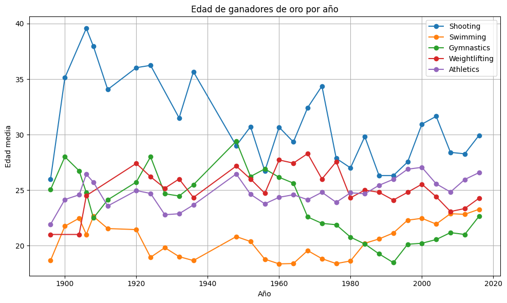
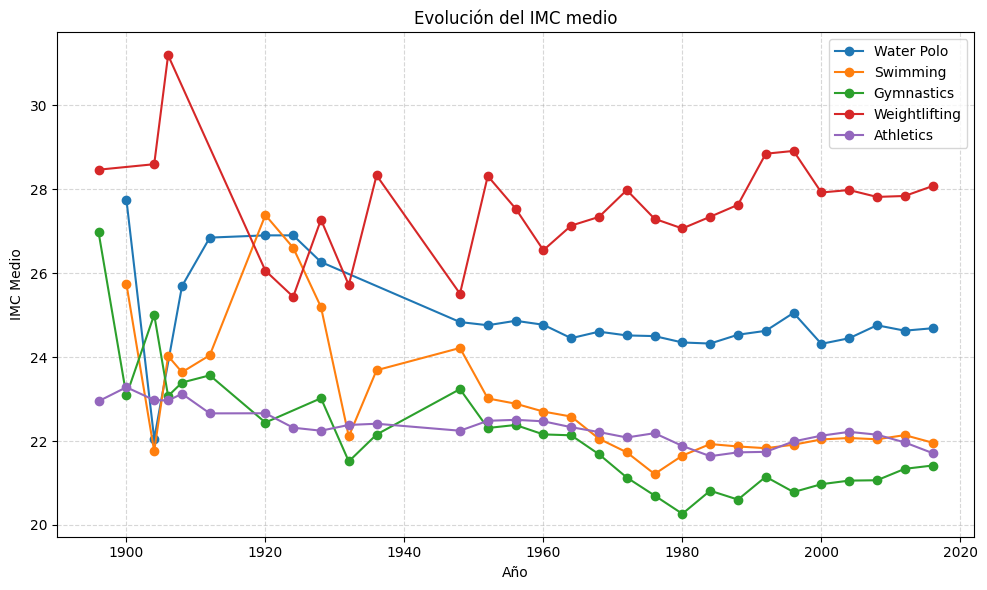
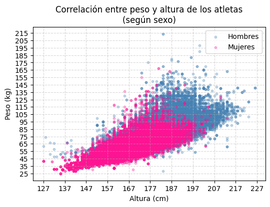

# 120 Años de Historia Olímpica — Análisis Exploratorio con SQL

Análisis exploratorio de los Juegos Olímpicos desde **Atenas 1896 hasta Río 2016** usando SQL y Python. El proyecto examina el desempeño deportivo por países y atletas, la evolución organizativa de los Juegos y las características físicas de los competidores a lo largo de 120 años de historia olímpica.

---

## Preguntas de investigación

**Desempeño deportivo**
- ¿Qué países han ganado más medallas de oro históricamente?
- ¿Cuáles son los países con mayor ratio de victoria (medallistas / atletas enviados)?
- ¿Cuáles son los atletas con más medallas de la historia?
- ¿Hay algún atleta que haya competido en varias disciplinas?
- ¿Qué países dominaron cada era olímpica?

**Organización**
- ¿Cuál es el deporte con más eventos en los JJOO?
- ¿Cómo ha evolucionado el número de atletas por año?
- ¿Cómo ha evolucionado la participación femenina a lo largo de la historia?

**Características físicas**
- ¿Cuáles son los deportes con mayor y menor diferencia de edad entre medallistas?
- ¿A qué edad suelen ganar los atletas? ¿Varía según el deporte?
- ¿Cuáles son las disciplinas con mayor y menor IMC medio?
- ¿Cómo ha evolucionado la especialización física a lo largo de los años?

---

## Hallazgos clave

| Indicador | Valor |
|---|---|
| País con más oros históricos | Estados Unidos — 1.131 |
| País con mejor ratio de victoria | Unión Soviética — 28% |
| Atleta con más oros | Michael Phelps — 23 |
| Deporte con más eventos históricos | Tiro y Atletismo — 83 cada uno |
| Participación femenina en 1896 | 0% |
| Participación femenina en 2016 | 45.5% (6.223 de 13.688 atletas) |
| Deporte con menor IMC medio | Gimnasia rítmica — 17.3 |
| Deporte con mayor IMC medio | Halterofilia — 27.7 |
| Mayor diferencia de edad entre medallistas | Croquet — 43 años |

Otros hallazgos destacados:
- La **Unión Soviética** dominó la Guerra Fría con 45.9 oros por edición, pese a competir solo entre 1952 y 1988.
- El número de atletas creció de **380 en Atenas 1896** a más de **11.000 en Barcelona 1992 y Río 2016**, con caídas visibles en guerras y boicots.
- El **IMC por deporte converge** hacia valores más estables a partir de los años 80, evidenciando una selección física cada vez más especializada.
- La edad óptima de victoria se sitúa generalmente entre los **18 y 30 años**, con variaciones significativas según la disciplina.

---

## Hipótesis

Antes del análisis se plantearon las siguientes hipótesis, todas verificadas con los datos:

- ✅ **Estados Unidos** lidera el medallero histórico total
- ✅ **Michael Phelps** es el mayor medallista de oro individual
- ✅ **La URSS** domina en ratio de victoria, no EE.UU.
- ✅ Los deportes de **puntería** tienen mayor rango de edad entre medallistas
- ✅ La especialización física se ha **estandarizado** con los años
- ✅ La participación femenina ha crecido hasta acercarse a la **paridad**

---

## Estructura del proyecto

```
📁 olympic-history-sql/
├── 📓 athlete_events.ipynb     # Notebook principal con el análisis completo
├── 📄 README.md
├── 📁 screenshots/             # Visualizaciones del análisis
└── 📁 data/                    # Archivos CSV del dataset (no incluidos)
    ├── athlete_events.csv
```

> ⚠️ Los archivos de datos **no están incluidos** en el repositorio. Ver instrucciones de descarga abajo.

---

## Descarga de datos

El dataset está disponible gratuitamente en Kaggle:

1. Entra en [https://www.kaggle.com/datasets/heesoo37/120-years-of-olympic-history-athletes-and-results](https://www.kaggle.com/datasets/heesoo37/120-years-of-olympic-history-athletes-and-results)
2. Descarga los archivos `athlete_events.csv` y `noc_regions.csv`
3. Colócalos en la carpeta `data/`

---

## Instalación y ejecución

### Requisitos

- Python 3.9 o superior
- Jupyter Notebook o JupyterLab

### Pasos

```bash
# 1. Clona el repositorio
git clone https://github.com/boperdose/olympic-history-sql.git
cd olympic-history-sql

# 2. Instala las dependencias
pip install pandas numpy matplotlib

# 3. Descarga los datos de Kaggle y colócalos en data/

# 4. Abre el notebook
jupyter notebook athlete_events.ipynb
```

### Dependencias principales

| Librería | Uso |
|---|---|
| `pandas` | Carga y manipulación de datos |
| `sqlite3` | Motor SQL para las consultas (incluido en Python) |
| `numpy` | Operaciones numéricas |
| `matplotlib` | Visualizaciones |

---

## Visualizaciones incluidas

| Visualización | Descripción |
|---|---|
|  | Evolución del número de atletas 1896–2016 |
|  | Comparativa de participantes en JJOO de Verano e Invierno |
|  | Evolución de la participación de mujeres por año |
|  | Edad media de ganadores de oro por deporte y año |
|  | IMC medio por disciplina olímpica |
|  | Evolución del IMC por deporte a lo largo de los años |
|  | Correlación entre peso y altura por sexo |

---

## Limitaciones

- El dataset cubre hasta **Río 2016** — no incluye Tokio 2020 ni París 2024.
- El sobreconteo en deportes de equipo ha sido mitigado usando `DISTINCT` en las queries de medallas.
- Los datos de peso y altura tienen valores nulos significativos en ediciones anteriores a 1960.

---

## Fuente de datos

**Kaggle** — 120 Years of Olympic History: Athletes and Results  
[https://www.kaggle.com/datasets/heesoo37/120-years-of-olympic-history-athletes-and-results](https://www.kaggle.com/datasets/heesoo37/120-years-of-olympic-history-athletes-and-results)

- Cobertura: Atenas 1896 — Río 2016
- Registros: 271.116 filas · 15 columnas
- Incluye: Juegos de Verano e Invierno

---

## Autor

**Eloy Jalloul Xicart**  
Estudiante de Matemáticas  
[eljallxi12@gmail.com] · [LinkedIn]
