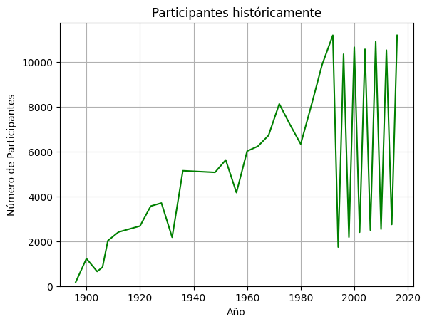
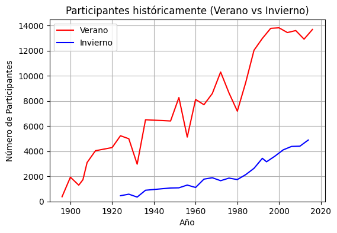
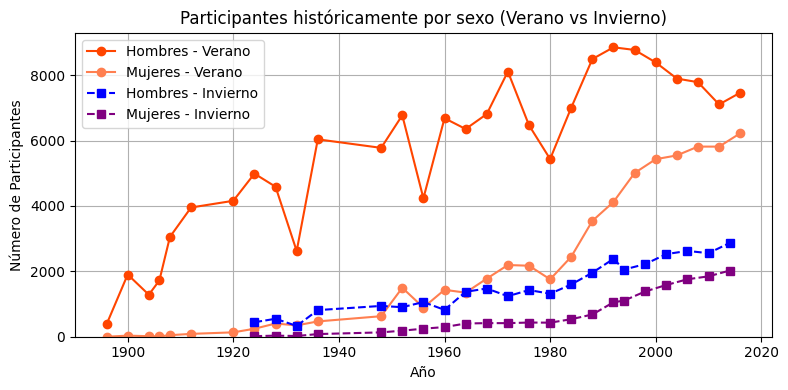
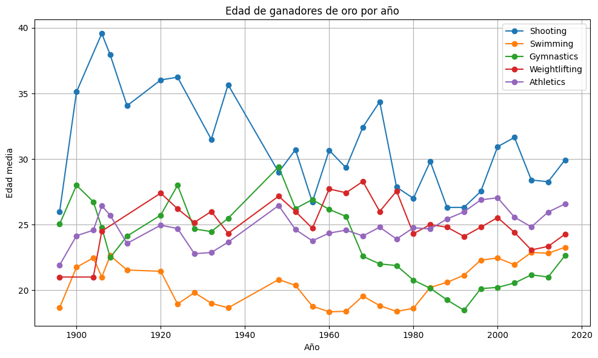
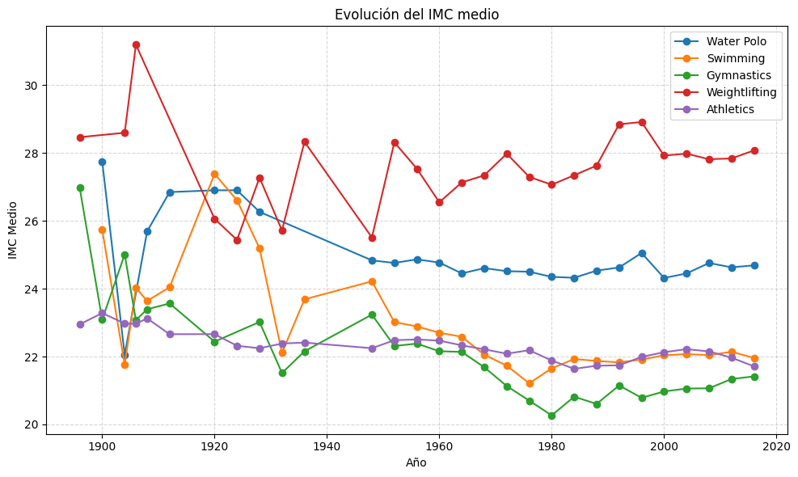
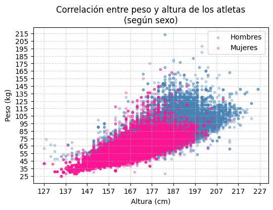

# 120 Años de Historia Olímpica — Análisis Exploratorio con SQL

Análisis exploratorio de los Juegos Olímpicos desde **Atenas 1896 hasta Río 2016** usando SQL y Python. El proyecto examina el desempeño deportivo por países y atletas, la evolución organizativa de los Juegos y las características físicas de los competidores a lo largo de 120 años de historia olímpica.

---

## Preguntas de investigación

**Desempeño deportivo**
- ¿Qué países han ganado más medallas de oro históricamente?
- ¿Cuáles son los países con mayor ratio de victoria (medallistas / atletas enviados)?
- ¿Cuáles son los atletas con más medallas de la historia?
- ¿Hay algún atleta que haya competido en varias disciplinas?
- ¿Qué países dominaron cada era olímpica?

**Organización**
- ¿Cuál es el deporte con más eventos en los JJOO?
- ¿Cómo ha evolucionado el número de atletas por año?
- ¿Cómo ha evolucionado la participación femenina a lo largo de la historia?

**Características físicas**
- ¿Cuáles son los deportes con mayor y menor diferencia de edad entre medallistas?
- ¿A qué edad suelen ganar los atletas? ¿Varía según el deporte?
- ¿Cuáles son las disciplinas con mayor y menor IMC medio?
- ¿Cómo ha evolucionado la especialización física a lo largo de los años?

---

## Hallazgos clave

| Indicador | Valor |
|---|---|
| País con más oros históricos | Estados Unidos (1.131) |
| País con mejor ratio de victoria | Unión Soviética (28%) |
| Atleta con más oros | Michael Phelps (23) |
| Deporte con más eventos históricos | Tiro y Atletismo (83 cada uno) |
| Participación femenina en 1896 | 0% |
| Participación femenina en 2016 | 45.5% (6.223 de 13.688 atletas) |
| Deporte con menor IMC medio | Gimnasia rítmica (17.3) |
| Deporte con mayor IMC medio | Halterofilia (27.7) |
| Mayor diferencia de edad entre medallistas | Croquet (43 años) |

Otros hallazgos destacados:
- La **Unión Soviética** dominó la Guerra Fría con 45.9 oros por edición, pese a competir solo entre 1952 y 1988.
- El número de atletas creció de **380 en Atenas 1896** a más de **11.000 en Barcelona 1992 y Río 2016**, con caídas visibles en guerras y boicots.
- El **IMC por deporte converge** hacia valores más estables a partir de los años 80, evidenciando una selección física cada vez más especializada.
- La edad óptima de victoria se sitúa generalmente entre los **18 y 30 años**, con variaciones significativas según la disciplina.

---

## Hipótesis

Antes del análisis se plantearon las siguientes hipótesis, todas verificadas con los datos:

- ✅ **Estados Unidos** lidera el medallero histórico total
- ✅ **Michael Phelps** es el mayor medallista de oro individual
- ✅ **La URSS** domina en ratio de victoria, no EE.UU.
- ✅ Los deportes de **puntería** tienen mayor rango de edad entre medallistas
- ✅ La especialización física se ha **estandarizado** con los años
- ✅ La participación femenina ha crecido hasta acercarse a la **paridad**

---

## Estructura del proyecto

```
📁 olympic-history-sql/
├── 📓 athlete_events.ipynb               # Análisis exploratorio con SQL
├── 📓 modelo_predictivo_olimpiadas.ipynb  # Modelo ML de predicción de categoría deportiva
├── 📄 README.md
├── 📁 screenshots/                        # Visualizaciones del análisis
└── 📁 data/                               # Archivos CSV del dataset (no incluidos)
    ├── athlete_events.csv
    └── noc_regions.csv
```

> Los archivos de datos **no están incluidos** en el repositorio. Ver instrucciones de descarga abajo.

---

## Descarga de datos

El dataset está disponible gratuitamente en Kaggle:

1. Entra en [https://www.kaggle.com/datasets/heesoo37/120-years-of-olympic-history-athletes-and-results](https://www.kaggle.com/datasets/heesoo37/120-years-of-olympic-history-athletes-and-results)
2. Descarga los archivos `athlete_events.csv` y `noc_regions.csv`
3. Colócalos en la carpeta `data/`

---

## Instalación y ejecución

### Requisitos

- Python 3.9 o superior
- Jupyter Notebook o JupyterLab

### Pasos

```bash
# 1. Clona el repositorio
git clone https://github.com/boperdose/olympic-history-sql.git
cd olympic-history-sql

# 2. Instala las dependencias
pip install pandas numpy matplotlib scikit-learn

# 3. Descarga los datos de Kaggle y colócalos en data/

# 4. Abre el notebook de análisis exploratorio
jupyter notebook athlete_events.ipynb

# 5. O abre el notebook de Machine Learning
jupyter notebook modelo_predictivo_olimpiadas.ipynb
```

### Dependencias principales

| Librería | Uso |
|---|---|
| `pandas` | Carga y manipulación de datos |
| `sqlite3` | Motor SQL para las consultas (incluido en Python) |
| `numpy` | Operaciones numéricas |
| `matplotlib` | Visualizaciones |
| `scikit-learn` | Modelos de Machine Learning |

---

## Visualizaciones incluidas

| Visualización | Descripción |
|---|---|
|  | Evolución del número de atletas 1896–2016 |
|  | Comparativa de participantes en JJOO de Verano e Invierno |
|  | Evolución de la participación de mujeres por año |
|  | Edad media de ganadores de oro por deporte y año |
|  | Evolución del IMC por deporte a lo largo de los años |
|  | Correlación entre peso y altura por sexo |

---

## 🤖 Machine Learning — Predicción de categoría deportiva

El notebook `modelo_predictivo_olimpiadas.ipynb` extiende el análisis exploratorio
con un modelo predictivo que, dado el perfil físico de un atleta, predice
a qué categoría deportiva pertenece.

### Pregunta de investigación

> *¿Es posible predecir la categoría deportiva de un atleta olímpico
> a partir de su edad, altura, peso, sexo e IMC?*

### Metodología

- **Variables**: edad, altura, peso, sexo e IMC (variable derivada)
- **Variable objetivo**: 7 categorías físicas (Resistencia, Fuerza y Potencia,
  Coordinación Técnica, Deportes de Equipo, Velocidad y Explosividad,
  Precisión y Control, Técnico Estratégico)
- **Modelos comparados**: Logistic Regression (baseline) y Random Forest
- **División de datos**: 60% train / 20% validación / 20% test
- **Métricas**: Accuracy, F1 Macro y Top-3 Accuracy

### Resultados

| Modelo | Accuracy | F1 Macro |
|---|---|---|
| Baseline aleatorio | 0.143 | 0.143 |
| Logistic Regression | 0.141 | 0.090 |
| Random Forest (sin ajuste) | 0.438 | 0.402 |
| **Random Forest (ajustado)** | **0.416** | **0.372** |

El Random Forest ajustado clasifica correctamente el **41.6% de los atletas**
frente al 14.3% de un clasificador aleatorio — una mejora de 2.9x sobre el azar.
El ajuste de hiperparámetros redujo el overfitting de 0.202 a **0.013** de
diferencia entre train y validación.

### Hallazgos ML

- El **peso, la edad y la altura** son las variables más predictivas (~23-24% cada una),
  refutando parcialmente la hipótesis de que peso y altura dominarían sobre la edad.
- **Coordinación Técnica y Flexibilidad** es la categoría más fácil de predecir (77%),
  gracias al perfil físico extremo de gimnastas y patinadores artísticos.
- **Precisión y Control** es la más difícil (22%) — en estos deportes el físico
  no determina el rendimiento.
- Deportes como el **Atletismo** introducen ruido al agrupar disciplinas con perfiles
  físicos opuestos (maratoniano vs velocista) bajo el mismo nombre.

### Demo interactiva

El notebook incluye una función que predice las 3 categorías más probables
para cualquier perfil físico introducido:

```python
predecir_categoria(edad=19, altura=158, peso=52, sexo="F")
# → 1. Coordinacion Tecnica Flexibilidad  68.3%  ████████████████████████████
# → 2. Resistencia                        12.1%  ████
# → 3. Deportes de Equipo                  8.4%  ███
```

---

## Limitaciones

- El dataset cubre hasta **Río 2016** — no incluye Tokio 2020 ni París 2024.
- El sobreconteo en deportes de equipo ha sido mitigado usando `DISTINCT` en las queries de medallas.
- Los datos de peso y altura tienen valores nulos significativos en ediciones anteriores a 1960.
- La agrupación en 7 categorías físicas es una decisión subjetiva — una agrupación
  diferente produciría resultados distintos.
- Deportes con subcategorías físicamente heterogéneas (como el Atletismo) introducen
  ruido en el modelo que no puede corregirse sin datos más granulares.

---

## Fuente de datos

**Kaggle** — 120 Years of Olympic History: Athletes and Results  
[https://www.kaggle.com/datasets/heesoo37/120-years-of-olympic-history-athletes-and-results](https://www.kaggle.com/datasets/heesoo37/120-years-of-olympic-history-athletes-and-results)

- Cobertura: Atenas 1896 — Río 2016
- Registros: 271.116 filas · 15 columnas
- Incluye: Juegos de Verano e Invierno

---

## Autor

**Eloy Jalloul Xicart**  
Estudiante de Matemáticas  
[eljallxi12@gmail.com] · [LinkedIn]
